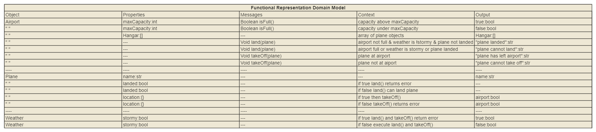

# airport-java-challenge
## About

A redo of the airport challenge in Java, demostrating knowledge in Java and TDD process in java.
### Built With

* [Gradle](https://docs.gradle.org/current/userguide/userguide.html)
* [Mockito](https://site.mockito.org/)

## Getting Started
These instructions will get you a copy of the project up and running on your local machine for development and testing purposes.

### Prerequisites

To clone and run this application, you'll need;

* [Git](https://git-scm.com/downloads)

* IDE ([intellj](https://www.jetbrains.com/idea/) recommended)

### Installation
```bash
From your command line:

# Clone this repository
git clone https://github.com/ndowkunda/airport-java-challenge.git

# Go into the repository
cd airport-java-challenge && airport-java

```
## Problem Approach

### Acceptance Criteria

**Standard**
```markdown

As an air traffic controller
So I can get passengers to a destination
I want to instruct the airport to land a plane

As the system designer
So that the software can be used for many different airports
I would like a default airport capacity that can be overridden as appropriate

As an air traffic controller
To ensure safety
I want to prevent landing when the airport is full

As an air traffic controller
So I can get passengers on the way to their destination
I want to instruct the airport to let a plane take off and confirm that it is no longer in the airport

As an air traffic controller
To avoid confusion
I want to prevent asking the airport to let planes take-off which are not at the airport, or land a plane that's already land

```
**Extended**
```markdown
As an air traffic controller
To ensure safety
I want to prevent takeoff when weather is stormy

As an air traffic controller
To ensure safety
I want to prevent landing when weather is stormy

As an air traffic controller
To count planes easily
Planes that have landed must be at an airport

```
### Domain model 


## Sample Tests

This project uses junit5 for its unit tests and mockito to mock other class dependencies for the airport class shown below 

### Test Setup

```java
public class AirportTest {
    Airport gatwick;
    Plane mockPlane;
    Plane mockPlane2;
    Weather mockWeather;

    @BeforeEach
    public void setUp() {
        mockPlane = Mockito.spy(new Plane("airbusA320"));
        mockPlane2 = Mockito.spy(new Plane("airbusA321"));
        mockWeather = mock(Weather.class);
        when(mockWeather.isStorm()).thenReturn(false);
        gatwick = new Airport(1);
    }
}
```
### Nested Test Classes

Within the AirportTest Class tests for the acceptance criterias have been separated into their own set of nested classes.
Shown below are the set of tests which must pass to demonstrate the airport capacity criteria has been met. 

```java
@Nested
@DisplayName("Test Airport Capacity")
class AirportCapacity {
    @Test
    public void defaultCapacityReached() {
        gatwick.land(mockPlane.name, mockWeather);
        gatwick.land(mockPlane2.name, mockWeather);
        Assertions.assertEquals(1, gatwick.countHangar());
    }

    @Test
    public void defaultCapacityAltered() {
        gatwick.maxCapacity = 2;
        gatwick.land(mockPlane.name, mockWeather);
        gatwick.land(mockPlane2.name, mockWeather);
        Assertions.assertEquals(2, gatwick.countHangar());
    }
}
```

