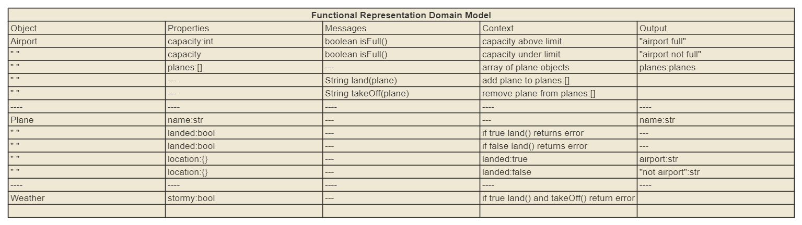

# airport-java-challenge
## About

A redo of the airport challenge in Java, demostrating knowledge in Java and TDD process in java.
### Built With

* [Gradle](https://docs.gradle.org/current/userguide/userguide.html)

## Getting Started
These instructions will get you a copy of the project up and running on your local machine for development and testing purposes.

### Prerequisites

To clone and run this application, you'll need;

Git

Node.js (which comes with npm) installed on your computer.
or 
IDE (intellj used to build this project)

### Installation
```markdown
From your command line:

# Clone this repository
git clone https://github.com/ndowkunda/airport-java-challenge.git

# Go into the repository
cd airport-java-challenge && airport-java

```
## Problem Approach

### Acceptance Criteria

**Standard**
```markdown

As an air traffic controller
So I can get passengers to a destination
I want to instruct the airport to land a plane

As the system designer
So that the software can be used for many different airports
I would like a default airport capacity that can be overridden as appropriate

As an air traffic controller
To ensure safety
I want to prevent landing when the airport is full

As an air traffic controller
So I can get passengers on the way to their destination
I want to instruct the airport to let a plane take off and confirm that it is no longer in the airport

As an air traffic controller
To avoid confusion
I want to prevent asking the airport to let planes take-off which are not at the airport, or land a plane that's already land

```
**Extended**
```markdown
As an air traffic controller
To ensure safety
I want to prevent takeoff when weather is stormy

As an air traffic controller
To ensure safety
I want to prevent landing when weather is stormy

As an air traffic controller
To count planes easily
Planes that have landed must be at an airport

```
### Domain model 


### Tests

This project uses junit for its unit tests

```java
//Airport class unit tests

```

## Usage

### User Interactions

Demo of landing a plane


Demo of a plane take off


## Acknowledgements

-